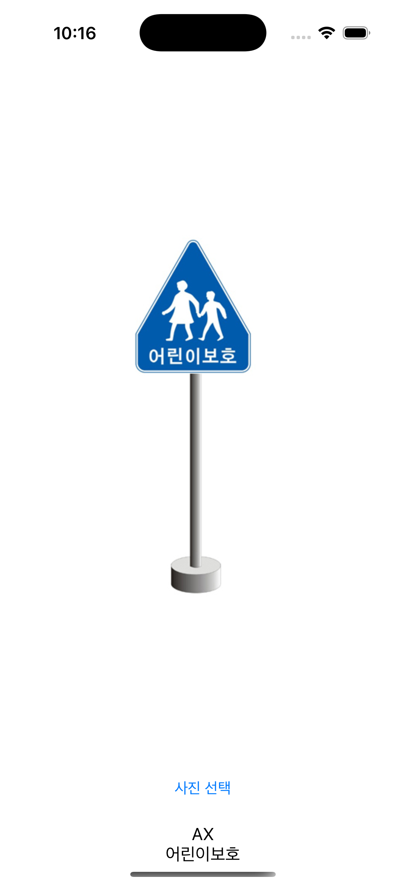
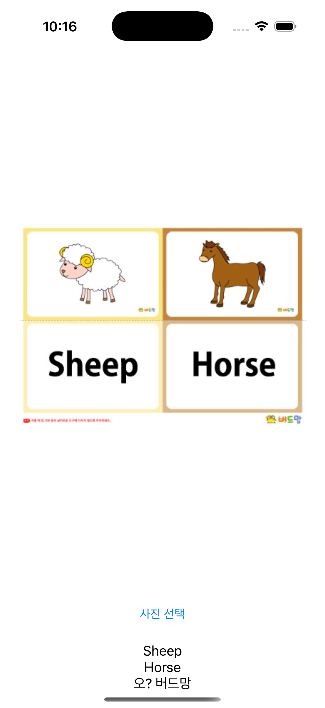

# OCRExample-Swift
> `Vision`, `AVFoundation` 프레임워크를 활용한 OCR(이미지 속 글자를 추출) + TTS(음성으로 읽어주는) iOS 예제 프로젝트입니다.

## ✨ 기능 소개

| 기능 | 설명 |
|------|------|
| 📷 이미지에서 텍스트 추출 | Vision의 `VNRecognizeTextRequest`를 활용해 OCR 수행 |
| 🧠 추출된 텍스트 자동 분리 | 줄 단위로 텍스트를 분리하여 보여줌 |
| 🗣️ 클릭하여 음성 출력 | `AVSpeechSynthesizer`로 선택된 줄을 TTS로 읽음 |
| 🇰🇷 한국어 & 🇺🇸 영어 등 다국어 지원 | 언어 설정은 `.korean`, `.english` 등 enum으로 관리 |

---

## 📸 화면 예시

---

## 🛠 사용 기술

- `UIKit`
- `Vision` – OCR (텍스트 인식)
- `AVFoundation` – TTS (텍스트 음성 변환)
- `UIImagePickerController` – 사진 선택

---
